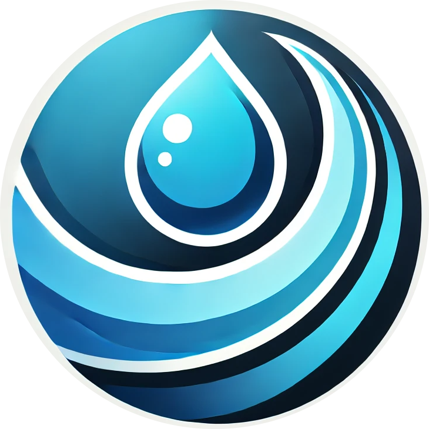

# Simple Blogging Platform

This is a basic blogging platform built with Express.js, allowing users to create and view posts. Users can access a home page to see all posts, a profile page, and a new post creation page.

## Features

- **Create Posts**: Users can create new blog posts with titles and content.
- **View Posts**: Users can view all posts and see the content of individual posts.
- **Static Files**: Serve static files (like CSS and images) from the `public` directory.

## Technologies Used

- Node.js
- Express
- EJS (Embedded JavaScript templates)
- Body-parser for handling form submissions

## Setup Instructions

### Prerequisites

- Node.js (v14 or higher)
- npm (Node Package Manager)